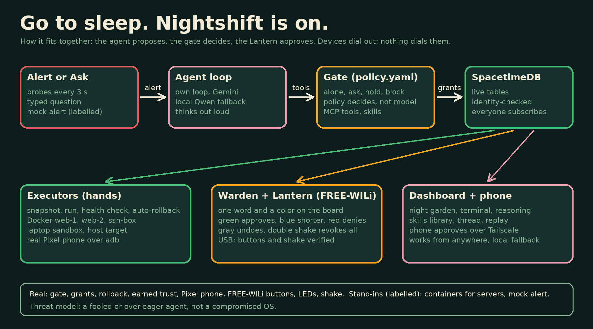
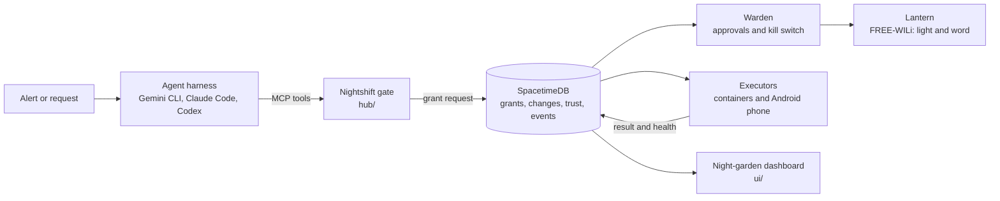

# Nightshift

**Sleep. Nightshift's on.**

An AI agent that fixes what breaks while you sleep, with a Lantern that glows when it needs you.

Built solo at MHacks 26 (Ann Arbor, Oct 3 to 4, 2026).

It is 3 a.m. A server goes down. Nobody wakes up, and it fixes itself. When a fix is risky, a FREE-WILi wristband (the Lantern) glows amber and waits for your press. Every change can be undone.

## The idea in 20 seconds

1. Something breaks (a service dies, a config gets corrupted, a phone loses Wi-Fi).
2. An AI agent reads the logs and proposes a fix. It never touches a device directly.
3. The Nightshift gate checks the command against a policy file. Safe and reversible fixes run alone. Risky ones wait for a press. Dangerous ones are blocked.
4. The executor snapshots first, runs the fix, runs a health check, and rolls back by itself if the check fails.
5. Trust is earned: a fix that has worked three times is promoted from "ask" to "alone".

## How it fits together






Every light on the Lantern and every flower on the dashboard comes from a real database row, so what you see is what happened.

## The autonomy ladder

| Level | What happens | Example |
|---|---|---|
| Observe | Read only | Read logs, check status |
| Alone | Allowlisted and reversible. Snapshot, run, health check, auto-rollback. | Restart a down service, restore a known-good config, toggle phone Wi-Fi |
| Ask | Waits for a press | A new fix that has not earned trust yet |
| Hold | Press and hold | Hard to undo |
| Never | Blocked by policy, no press can allow it | `rm -rf`, anything a poisoned log line asks for |

Safety limits: a circuit breaker stops a device after 2 failed fixes or 6 autonomous actions in an hour, and one button cuts all grants.

## What is real and what is a stand-in

| Piece | Status |
|---|---|
| Policy gate, grants, audit trail, rollback, earned trust | Real code |
| Android phone (Pixel 9 Pro over adb) | Real device |
| FREE-WILi display and LEDs | Real hardware |
| `web-1` and `web-2` | Docker containers standing in for servers, labelled as such |
| The alert that starts a demo | A mock webhook, labelled MOCK |
| FREE-WILi buttons | Not working yet on this firmware; approvals use keyboard keys or a phone page |
| FREE-WILi sound | Off by default (tones got stuck) |

## Threat model

We defend against a fooled or over-eager agent, not a compromised operating system. The agent only reaches devices through the gate, the gate classifies commands from policy (never from the agent), and only the warden identity can approve or kill. Identity checks are enforced in the database module and covered by security tests.

## Measured so far

A few real runs, so treat these as rough:

- Claude Sonnet, one service-down fix: about 31k tokens, $0.036, 16 s.
- Gemini (`gemini-3-flash-preview`), service-down fix, 3 runs: about $0.064 on average, about 83 s. Prices used are list prices that are not yet verified.

A broader benchmark across all scenarios is in progress. We do not claim fleet savings.

## Layout

- `spacetime/`   SpacetimeDB TypeScript module (grants, changes, incidents, trust, scheduled expiry)
- `hub/`         MCP gateway, policy engine, headless harness launcher, mock alert webhook
- `agents/`      executors (containers, Android), warden, and `freewili/` Python bridge for the Lantern
- `workspaces/`  per device type: `SKILL.md` runbook and `policy.yaml`
- `ui/`          React night-garden dashboard
- `docs/`        CONTRACT (interfaces), PLAN, DEMO_SCRIPT, SUBMISSION, ref/ (doc digests)

## Stack

SpacetimeDB 2.x (local), Node 22 and TypeScript, MCP TypeScript SDK, Python 3.12 and uv (FREE-WILi OneWili library), adb, Docker, React and Vite, Gemini CLI as the default harness.

## Run it

Needs SpacetimeDB CLI 2.x, Node 22, Docker, and optionally a phone with USB debugging and a FREE-WILi.

```
spacetime start --listen-addr 127.0.0.1:3000          # local database
cd spacetime && spacetime publish --server local nightshift
cd hub && npx tsx src/serve.ts                          # gate, watcher, mock alert webhook
cd agents/exec && npm start                             # executors
cd agents/warden && npx tsx src/warden.ts --backend sim # or --backend onewili
cd ui && npm run dev                                    # dashboard
```

Break something and send the mock alert (see `demo/` and `docs/DEMO_SCRIPT.md`):

```
demo/break.sh web-1 service
curl -s -XPOST localhost:8787/alert -d '{"device":"web-1","alert":"service down"}'
```

## Rules for ourselves

- One scenario, flawless. Anything the 2 minute demo does not show gets cut.
- Every UI animation and light state comes from a real `event` row.
- Offline first: local database, USB or hotspot only.

MIT licensed.
